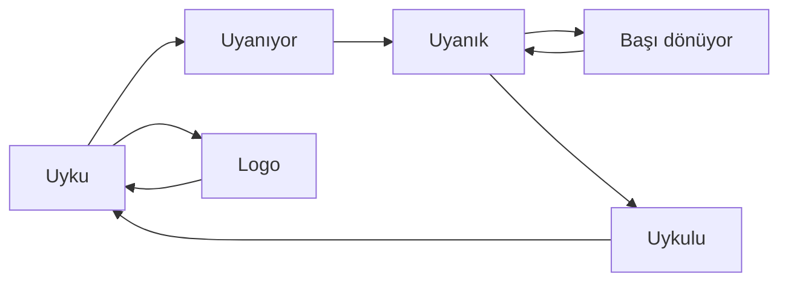

# 🤖 Mühendisçe Robot Yüz

ESP32-C3 Super Mini ve 240x240 renkli ekranla yapılmış, **göz kırpan, uyuyan, uyanan, sallanınca başı dönen** sevimli bir robot yüzü. Tek bir Arduino kodu, birkaç kablo ve bir LiPo pil yeterli. Lehim gerekmiyor.

> Bu proje [Mühendisçe](https://instagram.com/KULLANICI_ADIN) için hazırlandı: mühendisliği çocuklara, ailelere ve meraklılara anlaşılır kılmak için.

<!-- Buraya demo GIF'i veya fotoğraf ekle: -->
<!--  -->

---

## ✨ Ne yapıyor?

Robot, kod içindeki bir senaryoyla kendi kendine oynar ve başa sarar:

| Süre | Ne oluyor |
|---|---|
| 0–2,5 sn | Uyuyor, yukarı süzülen **Zzz** harfleri |
| 2,5 sn | Uyanır, mutlu gözlerle **"Günaydın!"** der |
| 4,3 sn | **"Merhaba, ben robot!"** |
| 6,7–9 sn | **"Etrafa bakayım..."** diyerek gözleri sola, sonra sağa kayar |
| 9,6–12,9 sn | Gözler spirale döner, yıldızlar uçuşur: **"Yapma, başım döndü!"** |
| 12,9 sn | **"Hh... geçti galiba."** |
| 15,3–17,3 sn | **"Uykum geldi..."**, gözler kapanır |
| 22,3 sn | Sabit **Mühendisçe** logo ekranı |
| 28 sn | Başa sarar |

Öne çıkan detaylar:

- 💬 Alt yazılar **daktilo efektiyle** harf harf yazılır
- 🇹🇷 **Türkçe karakterler** (ş, ğ, ı, ö, ü, ç) ek font kütüphanesi olmadan çizilir
- 🎞️ **Titreşimsiz animasyon**: tüm kare önce hafızada çizilir, sonra ekrana tek seferde basılır (~30 FPS)
- 👀 Göz kırpma, nefes alma, parıltılı gözler, yanaklar ve dalgalı ağız

---

## 🧰 Malzemeler

| Parça | Adet | Not |
|---|---|---|
| ESP32-C3 Super Mini | 1 | Ana mikrodenetleyici |
| ESP32-C3 Super Mini genişletme kartı | 1 | LiPo pil girişi ve şarj devresi olan model |
| 240x240 renkli ekran (ST7789, SPI) | 1 | IPS LCD; çoğu satıcı "OLED" yazıyor ama **LCD**'dir |
| Dişi-dişi jumper kablo | 6–7 | Lehim gerekmez |
| LiPo pil (3.7 V) | 1 | Genişletme kartının konnektörüne uygun olsun |
| USB-C kablo | 1 | Kod yüklemek ve şarj için |

> 💡 Ekran modülünde sadece **7 pin** varsa (GND, VCC, SCL, SDA, RES, DC, BLK) CS pini yoktur. Bu projenin kodu da bu tip modül için yazıldı.

---

## 🔌 Bağlantılar

Ekran, ESP32-C3'ün donanımsal SPI pinlerini kullanır.

| Ekran pini | ESP32-C3 Super Mini | Açıklama |
|---|---|---|
| **GND** | GND | Toprak |
| **VCC** | 3V3 | Besleme (3.3 V) |
| **SCL** | GPIO 4 | SPI saat (SCK) |
| **SDA** | GPIO 6 | SPI veri (MOSI) |
| **RES** | GPIO 1 | Reset |
| **DC** | GPIO 0 | Veri/komut seçimi |
| **BLK** | 3V3 | Arka ışık (her zaman açık) |
| CS *(varsa)* | GND | CS pini olan modellerde GND'ye bağla |

```text
   Ekran                 ESP32-C3 Super Mini
 ┌────────┐             ┌──────────────────┐
 │  GND   │─────────────│ GND              │
 │  VCC   │─────────────│ 3V3              │
 │  SCL   │─────────────│ GPIO 4           │
 │  SDA   │─────────────│ GPIO 6           │
 │  RES   │─────────────│ GPIO 1           │
 │  DC    │─────────────│ GPIO 0           │
 │  BLK   │─────────────│ 3V3              │
 └────────┘             └──────────────────┘
```

> ⚠️ **SDA/SCL isimleri kafa karıştırabilir.** SPI ekranlarda SCL "saat", SDA ise "veri" demektir. I2C ile ilgisi yoktur.

---

## 🔋 Pil ve genişletme kartı

1. ESP32-C3 Super Mini'yi genişletme kartının üzerine yerleştir.
2. Ekranın jumper kablolarını **kartın üzerindeki pin etiketlerine** göre tabloda yazan GPIO numaralarına bağla. Pinlerin yeri karttan karta değişebilir, etiketlere bak.
3. LiPo pili kartın pil konnektörüne tak.
4. USB-C takıldığında kart pili şarj eder. Pil takılıyken USB'siz de çalışır.

**Güvenlik notları:**

- 🔴 Pilin **artı (+) ve eksi (−) yönüne** dikkat et. Her pil konnektörü her kartla aynı kutuplamada olmayabilir. Takmadan önce kartın üzerindeki +/− işaretlerini kontrol et.
- Pili kısa devre yapma, ezme, delme.
- Şişmiş veya hasarlı pili kullanma.
- Şarj olurken cihazı gözetimsiz bırakma.
- Çocuklarla yaparken pil bağlantısını **bir yetişkin** yapsın.

---

## 💻 Yazılım kurulumu

### 1) Arduino IDE ve ESP32 kartı

1. [Arduino IDE](https://www.arduino.cc/en/software)'yi indir ve kur.
2. **Dosya → Tercihler → Ek Kart Yöneticisi URL'leri** kısmına şunu ekle:
   ```text
   https://raw.githubusercontent.com/espressif/arduino-esp32/gh-pages/package_esp32_index.json
   ```
3. **Araçlar → Kart → Kart Yöneticisi**'nden **esp32 (Espressif Systems)** paketini kur.

### 2) Kütüphaneler

**Araçlar → Kütüphaneleri Yönet** üzerinden şunları kur:

- `Adafruit GFX Library`
- `Adafruit ST7789 Library`

(Adafruit BusIO otomatik gelir. Başka kütüphane gerekmez.)

### 3) Kart ayarları

| Ayar | Değer |
|---|---|
| Kart | **ESP32C3 Dev Module** |
| USB CDC On Boot | **Enabled** (seri monitör için) |
| Upload Speed | 921600 (sorun olursa 115200) |

### 4) Yükleme

1. Bu repoyu indir veya klonla:
   ```bash
   git clone https://github.com/KULLANICI_ADIN/REPO_ADI.git
   ```
2. `robot_yuz2/robot_yuz2.ino` dosyasını Arduino IDE ile aç.
3. ESP32'yi USB ile bağla, doğru portu seç ve **Yükle**'ye bas.

> Kart bilgisayarda görünmüyorsa **BOOT** tuşuna basılı tutarak USB'yi tak, sonra tekrar yüklemeyi dene.

---

## 🧠 Kod nasıl çalışıyor?



Kodun ana parçaları:

- **Senaryo tablosu (`script[]`)**: Hangi saniyede hangi duygunun, bakışın ve alt yazının geleceğini belirler.
- **Tuval (`GFXcanvas16`)**: Her kare önce hafızada (~115 KB) çizilir, sonra ekrana basılır. Bu yüzden titreme olmaz.
- **Göz çizimi**: Yuvarlatılmış dikdörtgenler, parıltı daireleri, kapalı göz için hilal, mutlu göz için üstten kapatma.
- **Türkçe metin motoru**: Varsayılan 5x7 piksel font Türkçe harfleri bilmez. Kod, `ş ğ ı ö ü ç` harflerinin işaretlerini (kuyruk, nokta, breve) harfin üstüne/altına tek tek çizer.

---

## 🎛️ Kendine göre ayarla

### Senaryoyu değiştir

`script[]` tablosundaki her satır bir adımdır:

```cpp
{ 9600, S_DIZZY, false, 0, 0, "Yapma, başım döndü!", 3000, false },
//  ms   durum    uykulu  bakış  alt yazı              süre  mutlu
```

- İlk sütun, döngü başlangıcından itibaren **milisaniye**dir.
- Alt yazılar **en fazla 19 karakter** olmalı (ekrana sığması için).
- `CYCLE_END` değeri, logonun ne kadar kalıp döngünün ne zaman başa saracağını belirler.

### Renkler

`setup()` içindeki `C_EYE`, `C_PINK`, `C_BG` satırlarında `rgb(r, g, b)` değerlerini değiştir.

### Ekran ayarları

| Sorun | Çözüm |
|---|---|
| Görüntü ters veya yan | `tft.setRotation(0)` değerini 1, 2 veya 3 yap |
| Ekranda parazit / bozulma | `tft.setSPISpeed(40000000)` değerini `27000000` yap |
| Renkler ters (mavi yerine kırmızı) | Modül farklı olabilir; `tft.invertDisplay(true)` dene |

---

## 🛠️ Sorun giderme

| Belirti | Olası neden ve çözüm |
|---|---|
| Ekran beyaz kalıyor | RES ve DC pinlerini kontrol et; BLK'nın 3V3'e bağlı olduğundan emin ol |
| Ekran hiç açılmıyor | VCC/GND doğru mu? Kablolar tam oturuyor mu? |
| Ekranda anlamsız çizgiler | SPI hızını düşür (yukarıdaki tablo) |
| Seri monitörde "RAM yok!" yazıyor | Başka büyük bellek kullanan kod eklediysen çıkar; tuval ~115 KB ister |
| Yükleme hatası / port görünmüyor | BOOT tuşuna basılı tutarak USB tak; farklı bir USB-C **veri** kablosu dene |
| Türkçe harflerin işareti kaçık görünüyor | `drawTR()` fonksiyonundaki işaret koordinatlarını ince ayarla |

---

## 🗺️ Yol haritası

- [x] Senaryo tabanlı robot yüz
- [ ] **MPU6050** hareket sensörüyle: gözler eğime göre kayar, sallayınca gerçekten sersemler, masaya bırakınca uyur
- [ ] Daha fazla duygu (kızgın, şaşkın, aşık)
- [ ] Wi-Fi ile alt yazıyı telefondan gönderme
- [ ] Çocuklarla birlikte yapılacak adım adım atölye sürümü

---

## 📄 Lisans

Bu proje [MIT Lisansı](LICENSE) ile paylaşılmıştır. Kullanabilir, değiştirebilir ve paylaşabilirsin. Kaynak göstermen çok sevindirir. 🙌

---

## 🙋 İletişim

Mühendisçe, mühendisliği herkes için anlaşılır kılmak için çalışıyor.

- 📸 Instagram: [@KULLANICI_ADIN](https://instagram.com/KULLANICI_ADIN)
- Sorular ve önerileri **Issues** sekmesinden iletebilirsin.

Projeyi beğendiysen ⭐ vermeyi unutma!
